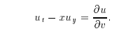
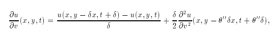

# Kolmogorov 2D PDE Solver

A Python library for solving **degenerate 2D Kolmogorov-type PDEs** using explicit finite difference schemes.

## Overview

This package provides numerical solvers for linear parabolic PDEs of the form:

<p align="center">
  
</p>

on the domain **(0,T) × (-X,X) × (-Y,Y)**.

The numerical scheme implements a specialized finite difference method adapted to the geometric structure of the Lie derivative, providing accurate approximations of the derivative:

<p align="center">
  
</p>

using the approximation:

<p align="center">
  
</p>

## Features

- Explicit finite difference solver for 2D Kolmogorov equations
- Boundary conditions and initial conditions
- NumPy-based for efficient numerical computation
- Pure Python implementation with minimal dependencies

## Installation

### From PyPI (when available)

```bash
pip install kolmogorov2D-solver
```

### From source

```bash
git clone https://github.com/giulioPecorella98/Kolmogorov-PDE-solver.git
cd Kolmogorov-PDE-solver
pip install -e .
```

**Requirements:**
- Python ≥ 3.11
- NumPy

## Quick Start

```python
from kolmogorov2D.solver import ExplicitSolver
import numpy as np

# Define domain: (0, T) × (-X, X) × (-Y, Y)
domain = [1.0, 1.0, 1.0]  # T=1, X=1, Y=1

# Create solver instance
solver = ExplicitSolver(domain)

# Define PDE coefficients a(t,x,y), b(t,x,y), c(t,x,y)
coefficients = (0.1, 0.0, -1.0)  # constants

# Define boundary and initial conditions
# (left, right, bottom, top, initial)
boundary_conditions = (0.0, 0.0, 0.0, 0.0, lambda x, y: np.exp(-(x**2 + y**2)))

# Solve the PDE
solution = solver.solve(coefficients, boundary_conditions)
```

## Package Structure

```
kolmogorov2D/
├── solver.py              # Main ExplicitSolver class
├── finite_difference.py   # Finite difference operators
├── visualization.py       # Plotting utilities
├── example.py             # Example usage and demonstrations
└── __init__.py            # Package initialization
```

## Module Documentation

### `solver.py`

Contains the main `ExplicitSolver` class for solving the equation with an explicit scheme:

### `finite_difference.py`

Implements discrete approximations for derivatives:
- `second_order_difference()` - Second-order spatial differences
- `central_difference()` - Central difference approximations

### `visualization.py`

Utilities for visualizing numerical solutions using Matplotlib.

## Mathematical Background

The solver handles PDEs of degenerate Kolmogorov type, characterized by:
- A parabolic structure with a drift term (-x·u_y)
- Variable coefficients for diffusion, advection, and reaction terms
- Initial and boundary value problem on rectangular domains

The explicit scheme adapts to the geometry of the Lie derivative, ensuring accuracy for this class of problems.

## Testing

Run the test suite to verify installation and functionality:

```bash
pytest tests/
```

**Test files:**
- `tests/test_solution.py` - Solution correctness tests
- `tests/test_runtime.py`  - Verify correctness of runtime
- `tests/test_inputs.py`   - Input validation tests

## License

This project is licensed under the **MIT License** - see the [LICENSE](LICENSE) file for details.

## Contributing

Contributions are welcome! Please feel free to:
- Report bugs through GitHub Issues
- Submit pull requests with improvements
- Suggest features or enhancements

## Author

**Giulio Pecorella**  
giuliopecorella98@gmail.com

## Citation

If you use this solver in your research, please cite:

```bibtex
@software{pecorella_2026_kolmogorov,
  title={Kolmogorov 2D PDE Solver},
  author={Pecorella, Giulio},
  year={2026},
  url={https://github.com/giulioPecorella98/Kolmogorov-PDE-solver}
}
```

## References

- Finite Difference Methods for PDEs
- Degenerate Parabolic Equations and Kinetic Theory